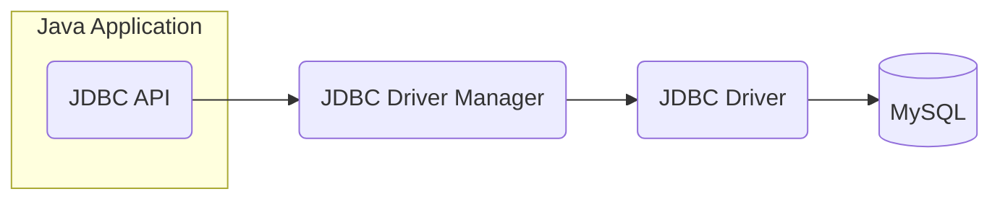

```java
/* This is an example of multi-line comment. */
import java.util.Scanner;
// create an object of Scanner
Scanner input = new Scanner(System.in);
// take input from the user
int number = input.nextInt();
// closing the scanner object
input.close();
```
### Ternary Operator in Java
`condition ? expression1 : expression2;`
**Note**: It is not recommended to use nested ternary operators. This is because it makes our code more complex.


## Examples:




## 📌 About Me -  backend4ever 🤍

I focus on creating simple, clean, and understandable Java code that’s easy for everyone to work with.

Follow me on [GitHub:@cristianbyte](https://github.com/cristianbyte) 🚀