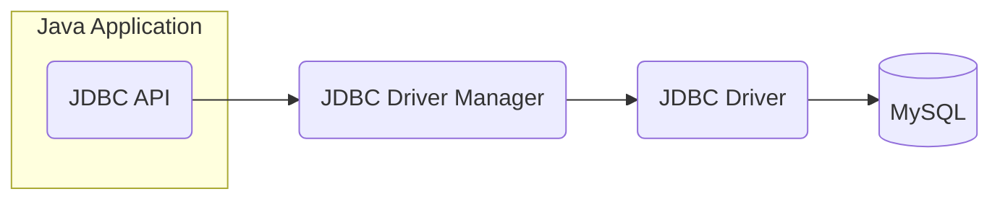

## 📌 About Me -  backend4ever 🤍

I focus on creating simple, clean, and understandable Java code that’s easy for everyone to work with.

Follow me on [GitHub:@cristianbyte](https://github.com/cristianbyte) 🚀