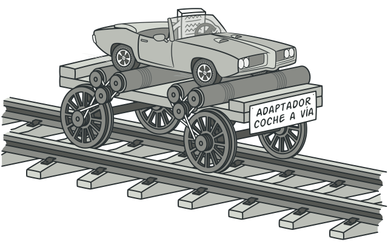

# Abstract Factory

Abstract Factory is a creational design pattern that allows us to produce families of related objects without specifying their concrete classes.

# Adapter

Is a structural pattern that allow colaboration between objects with incompatible interfaces.

